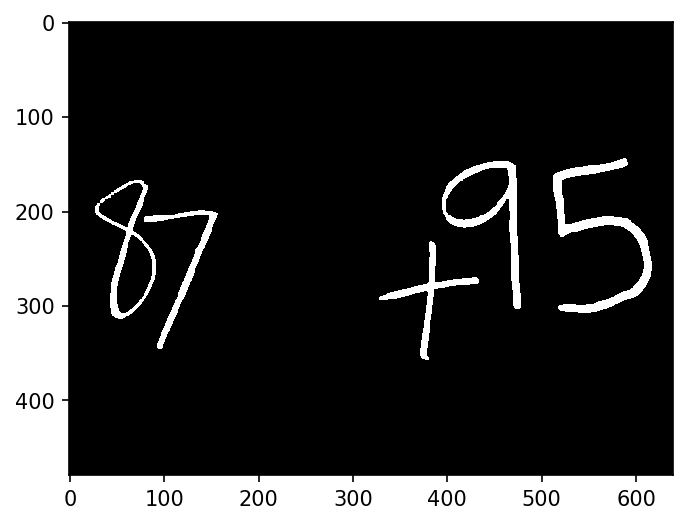

# simple-mathematical-expression-calculator

This is a simple system to take an image of a mathematical expression as input and evaluate it.

## supported operations
Only addition and subtraction are supported at the time due to the limitedness of the training set.

### notes
Due to broken links, I couldn't get the raw images of the dataset. So, I had to convert the dataset from matlab arrays to numpy arrays. Luckily enough, they are saved as `*.npy` and are loaded faster than raw data would have loaded.
## What's new
Remove the need to have an empty column of pixels between symbols in the image.
Now, they can overlap vertically as long as they don't touch each other.
## How it works
* The image is read as grayscale and is then converted to binary using thresholding.

* The bounding box *(green)* for each digit it extracted using its contour*(red)*.

* Using the filled contour of each symbol, it is extracted as an alpha channel for that symbol. 

* Each alpha channel is then combined with the binary image to get a clean picture of the individual symbol. 

* The ROI of each symbol is further cleaned by removing the empty rows and columns surrounding it. It doesn't make much of a difference but to be consistent with the training data

>There is an exception to ones (1) and the subtraction sign(-) because they would fill out the whole ROI hence they wouldn't be identified correctly. That's why there is a minimum height and width of each symbol. Whenever the symbol dimentions are less than the specified number, the symbol is padded with empty rows/columns.
* Each symbol is then resized to the same size of the training set (16*16).

* The resized symbols are fed to a pretrained neural network to classify to which symbol they belong.
* The classification results are then joined as operands and operations to be calculated at the end.

## Limitations
Because of the small dataset available (362 sample), the model sometimes predicts wrong numbers. However, I didn't consider training it on MNIST dataset as the addition and subtraction symbols would be greatly underrepresented relative to other digits.
